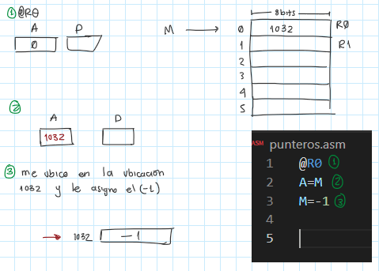
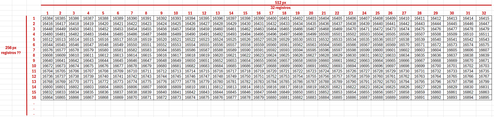
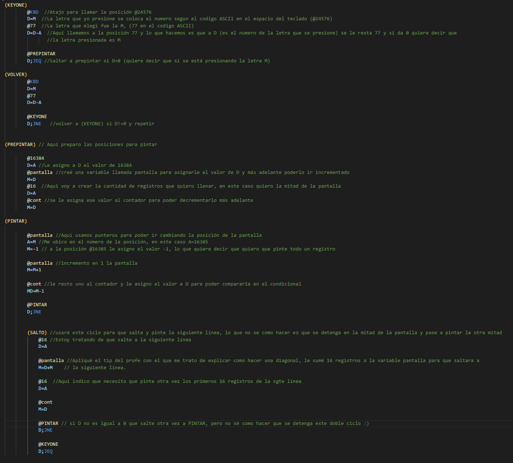
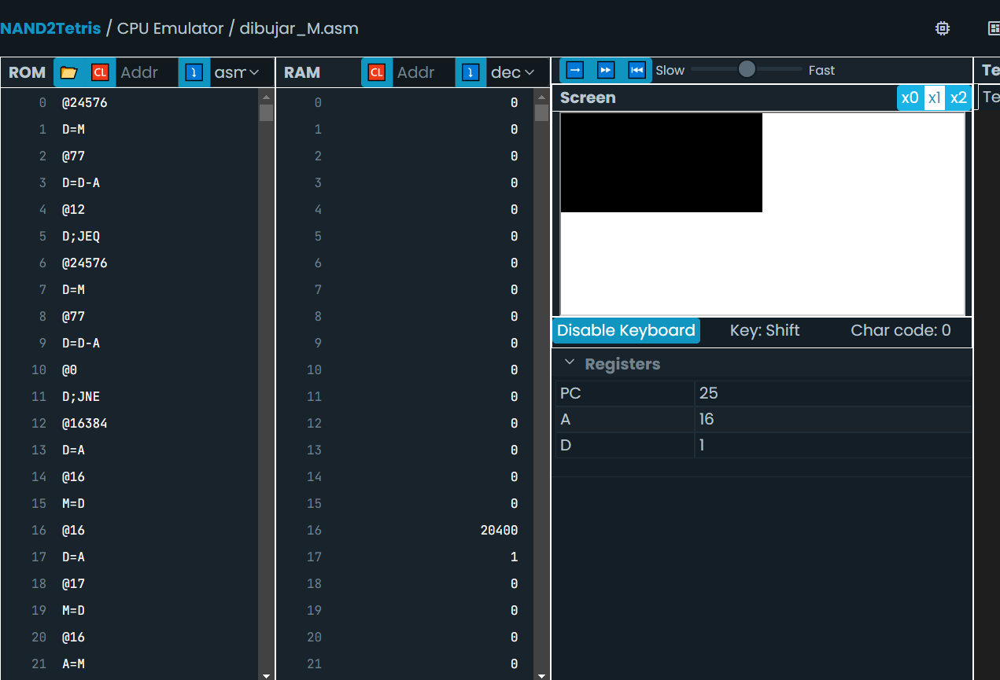
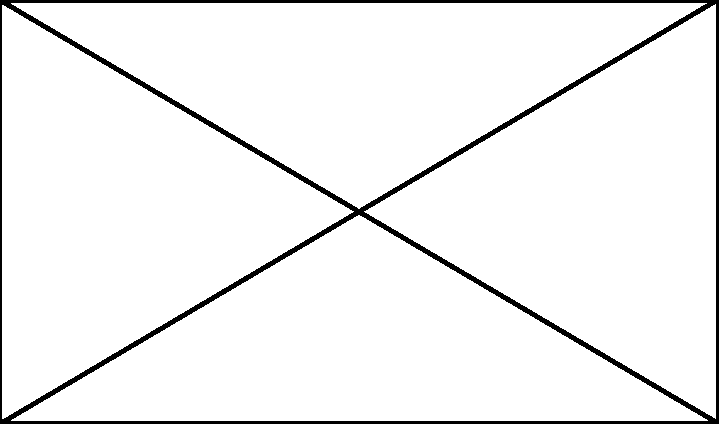
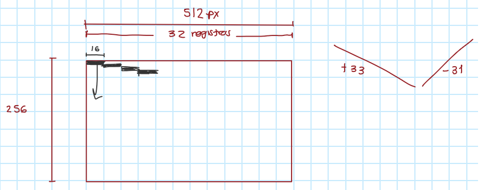
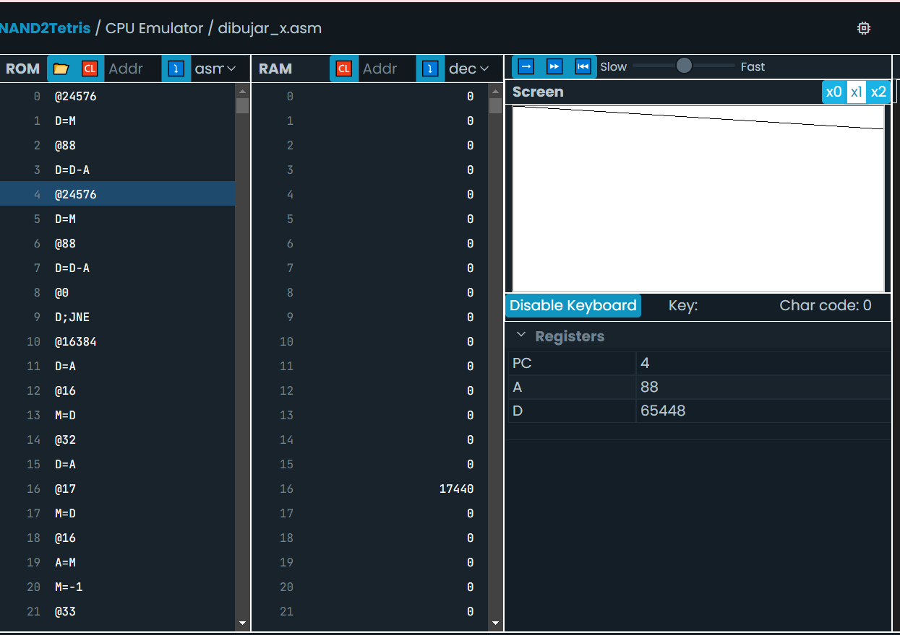

## 1er Experimento 
### Objetivo
El experimento trata de que al presionar la tecla M, se pinten dos cuadros en la pantalla de la siguiente manera:

### Procedimiento 
1.Primero decidí retroalimentar el tema de los punteros que vimos la clase pasada, todavía no entendía que significaba A=M (misma duda del ejercicio pasado). Esto lo hice porque quería entender bien como se pintaba la pantalla, el profe finakmente me explicó y lo logré comprender. 

2.Ahora tenía que comprender como era que funcionaba la pantalla, todavía tengo dudas pero traté de verlo más sencillo así que hice una tablita en excel intentando imitar los registos. 
Con esto conseguí ver como iba a usar los contadores en el código, además me di cuenta de que @KBD en lenguaje ensamblador se refiere a la posición del teclado @24576, así que lo apliqué en mi programa.

3.Empecé a montar el programa pero de manera muy experimental ya que no tenía muy claro que estaba haciendo. Finalmente llegué a esto y es casi funcional solo que no se muy bien como acabarlo. 

4.En el simulador llegué a que se viera así:

5.Para terminarlo se me ocurrieron varias ideas:
- Hacer un segundo contador para indicarle la cantidad de veces que debe realizar la función de (SALTO). Aquí tengo una duda muy grande porque no se como funcionan los registros hacia abajo entonces no sé cual es la mitad de la pantalla. 
- Luego de que establezca el contador para limitar el salto que rellena la primera mitad, pensaba crear una segunda función de (SALTO2) y en vez de sumarle a la variable pantalla 16 registros, le sumo 32 y así se rellenará la segunda mitad que quiero pintar

## 2do Experimento 
### Objetivo
En el segundo experimento quiero hacer una x de toda la pantalla cuando se presione la letra X de la siguiente manera:

### Procedimiento 
1.Para este ejercicio usaré un tip que me dió el profe sobre como puedo hacer la diagonal, consiste en hacer un loop donde por ejemplo se pinte la posición @16384 y luego se le vaya sumando progresivamente 33 registros para que se me vaya pintando una diagonal. Algo como esto: 

2.Como en el ejercicio anterior, voy a guiarme con mi tablita de excel que simula la pantalla y sus registros.

3.Empecé a montar el código, muy similar al del ejercicio anterior pero aplicando los tips del profe, me quedó de la sgte manera: 
 

4.En el simulador logré que se hiciera la primera diagonal pero no logré que hiciera la segunda :| , como se muestra en la imagen: 

